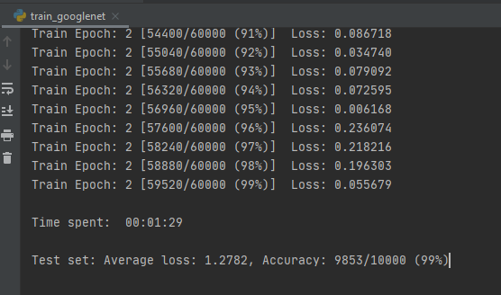

# NaiveGoogLeNet and GoogLeNet model training and test outputs analysis report

1. The training process on the GoogLeNet with MNIST Datasets, takes around 1min30secs to train the model per epoch (based on the timer I added in the training code).
After 2 epochs training, the test accuracy reaches to 99%.

2. The training process on the NaiveGoogleNet with MNIST Datasets, takes around 2min20secs to train the model per epoch (based on the timer I added in the training code).
After 3 epochs training, the test accuracy reaches to 99%.
3. Comparing the training performance, the googleNet with naive inception is very computationally expensive.
The training effiency is also lower than the GoogLeNet with v1 inception.

